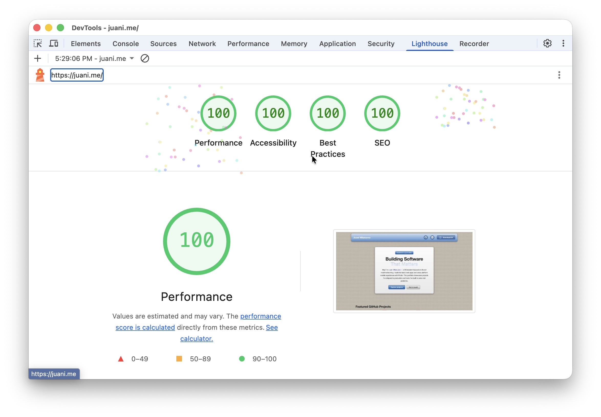

# Juani Villanueva – Personal website

Welcome to my personal portfolio website!  
This project showcases my journey as a Computer Science student and web developer, with a focus on responsiveness, tactile skeuomorphic design inspired by iOS 6, and a refined, user-centric experience.

---

## Features

- **iOS 6-Inspired Skeuomorphic Design**  
  Glossy multi-stop gradients, beveled edges, linen-weave textures, and engraved typography—every surface is crafted to feel physical and tactile, true to the classic Apple aesthetic.

- **100% Responsive**  
  Crafted from the ground up to look and work perfectly on any device—desktop, tablet, or mobile. No breakpoints left behind.

- **Consistent Design Language**  
  Every element aligns to a strict system of spacing, corner radius, and typography—no jarring visual jumps, just smooth, predictable UX.

- **Responsive Light/Dark Mode**  
  Your eyes, your rules. The entire UI adapts seamlessly for light and dark preferences—automatically, with dark brushed-metal surfaces in dark mode.

- **Fluid Animations**  
  Subtle, performant transitions and hover effects throughout—smooth card lifts, glossy button presses, and crisp bezel highlights.

- **SEO & Accessibility First**  
  - [x] **100/100 Lighthouse scores** (Performance, Accessibility, Best Practices, SEO)  
  - ARIA labels and semantic HTML, to be usable by everyone.
  - Open Graph & Twitter Card metadata for rich sharing.

- **Zero Frameworks**  
  No React, Vue, or Svelte.  
  Just pure, hand-crafted HTML, CSS, and JavaScript. Lean, portable, and fast.

---

## Tech Stack

- **HTML5** – Semantic, accessible structure.
- **CSS3** – Modern layout (Grid, Flexbox), custom properties, skeuomorphic depth layering, linen textures, dark mode, responsive breakpoints.
- **JavaScript (ES6+)** – Animations and interactivity.
