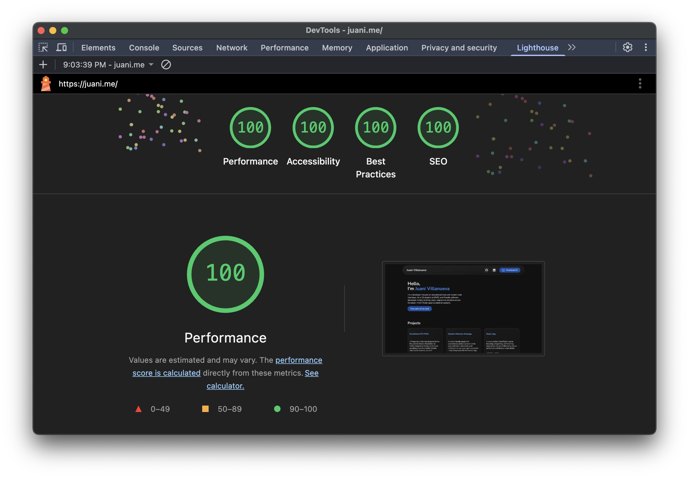

# Juani Villanueva – Personal website

Welcome to my personal portfolio website!  
This project showcases my journey as a Computer Science student and web developer, with a focus on responsiveness, modern web interface, and a refined, user-centric experience.

---

## Features

- **Modern Depth-Based Design**  
  Layered surfaces with subtle shadows, inset highlights, and carefully tuned lighting—delivering a refined, elevated, and accessible look.

- **100% Responsive**  
  Crafted from the ground up to look and work perfectly on any device—desktop, tablet, or mobile. No breakpoints left behind.

- **Consistent Design Language**  
  Every element aligns to a strict system of spacing, corner radius, and typography—no jarring visual jumps, just smooth, predictable UX.

- **Responsive Light/Dark Mode**  
  Your eyes, your rules. The entire UI adapts seamlessly for light and dark preferences—automatically.

- **Fluid Animations**  
  Subtle, performant transitions and hover effects everywhere—smooth bento grid reveal, soft button glows, and playful card pops.

- **SEO & Accessibility First**  
  - [x] **100/100 Lighthouse scores** (Performance, Accessibility, Best Practices, SEO)  
  - ARIA labels and semantic HTML, to be usable by everyone.
  - Open Graph & Twitter Card metadata for rich sharing.

- **Zero Frameworks**  
  No React, Vue, or Svelte.  
  Just pure, hand-crafted HTML, CSS, and JavaScript. Lean, portable, and fast.

---

## Tech Stack

- **HTML5** – Semantic, accessible structure.
- **CSS3** – Modern layout (Grid, Flexbox), custom properties, depth layering, dark mode, responsive breakpoints.
- **JavaScript (ES6+)** – Animations and interactivity.
